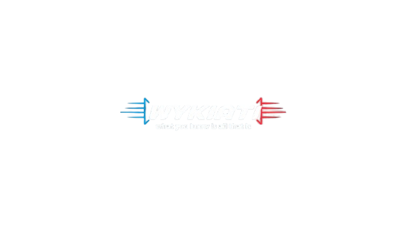

# Anki Wykiati Addon (Anki Discord & Full Black Toolkit)

A modular, high-performance Anki add-on providing automated image and flashcard ingestion from Discord channels and REST Webhooks, featuring an ultra-minimalist Full Void Black (`#000000`) theme with floating translucent glass styling.

---

## Visual Showcase & Result

<div align="center">
  
  <p><em>Anki Wykiati Full Black Interface — True #000000 Void Background with Centered Card Layout and Floating Translucent Controls.</em></p>
</div>

---

## Table of Contents

1. [Overview and Key Features](#1-overview-and-key-features)
2. [Visual Design and Theme Architecture](#2-visual-design-and-theme-architecture)
3. [Discord Image Ingestion Pipeline](#3-discord-image-ingestion-pipeline)
4. [Software Architecture and Data Flow](#4-software-architecture-and-data-flow)
5. [Discord Protocol and Commands](#5-discord-protocol-and-commands)
6. [Local HTTP Webhook Bridge](#6-local-http-webhook-bridge)
7. [Step-by-Step Testing Guide](#7-step-by-step-testing-guide)
8. [Installation and Distribution](#8-installation-and-distribution)
9. [Configuration Reference](#9-configuration-reference)
10. [Repository and License](#10-repository-and-license)

---

## 1. Overview and Key Features

The Anki Wykiati Addon connects Discord workflows with Anki collections:

- **Automated Image Channel Ingestion**: Point the add-on to dedicated Discord channels that receive filtered images. Every image attachment is automatically downloaded, saved to Anki's media storage (`collection.media`), and converted into an Anki card in your target deck without manual prompts.
- **Pure Void Black (#000000) Theme**: Total coverage across all Qt widgets, Top Navigation Toolbar, Deck Browser, Card Reviewer, and Bottom Action Bar.
- **Floating Translucent Capsule Buttons**: Pill buttons with subtle glass highlights (`rgba(255, 255, 255, 0.04)`) and hover transitions.
- **Centered Card and Image Layout**: Cards, paragraphs, and diagrams/images are perfectly centered horizontally and vertically with fluid scaling.
- **Hardware-Accelerated Zero-Lag Rendering**: GPU layer promotion (`translateZ(0)`) for smooth 144Hz performance without composite stalls.
- **Asynchronous Non-Blocking Queue**: Background daemon worker processes jobs and synchronizes notes onto Anki's main thread safely without freezing the interface.
- **Cryptographic Anti-Duplication**: SHA-256 binary content and message fingerprinting prevents re-importing duplicate cards or images.
- **Smart Deck Routing**: Route notes dynamically based on message tags, keywords, or channel defaults.
- **Local HTTP Bridge Server**: Built-in REST API on `http://127.0.0.1:8765/api/card` for external scripts, browser extensions, and developer tools.

---

## 2. Visual Design and Theme Architecture

<div align="center">
  
</div>

The visual design is inspired by modern developer software interfaces (Linear, Vercel, Apple Pro Dark Mode):

- **Backdrop**: Pure Void Black `#000000` base with zero gray tint.
- **Glass Surfaces**: Translucent dark surfaces (`#0A0A0D` / `rgba(255, 255, 255, 0.025)`) with subtle borders `1px solid rgba(255, 255, 255, 0.08)`.
- **Floating Pill Buttons**: Translucent rounded capsules (`border-radius: 20px`) with high-contrast primary actions.
- **Subtle Watermark Logo**: Minimalist vector watermark positioned exclusively on the Deck Browser start screen.
- **Shortcut**: Toggle the theme instantly inside Anki using `Ctrl+Shift+B`.

---

## 3. Discord Image Ingestion Pipeline

The primary workflow automatically pulls images from filtered Discord channels into specific Anki decks:

1. In Anki, open **Tools -> Anki Wykiati Toolkit -> Discord and Image Ingestion Settings**.
2. Enter the channel ID in **Image Channels (IDs)** (e.g., `123456789012345678`).
3. Set your target deck in **Target Image Deck** (e.g., `Medicine::Cardiology` or `Wykiati::Deck`).
4. Select card layout:
   - **Image on Front / Caption on Back** (Default): The downloaded image `` is placed on the front; message caption or text is placed on the back.
   - **Question on Front / Image on Back**: Text is placed on the front; image is placed on the back.
5. Save settings. Whenever an image is posted in the configured channel, the add-on automatically pulls the image into your Anki collection.

---

## 4. Software Architecture and Data Flow

The codebase is organized in decoupled layers following SOLID principles and Clean Architecture:

```text
  [Discord Bot REST Poller]        [Local HTTP Webhook]
             │                              │
             └──────────────┬───────────────┘
                            ▼
                [Authorization Policy]
            (Channel & User Whitelist, Rate Limit)
                            ▼
                    [Discord Bridge]
      (Detects Image Attachments vs. !anki Protocol)
                            ▼
             [Media Manager / Ingestion]
        (Downloads, Hashes SHA-256, Saves Media)
                            ▼
             [Anti-Duplication Registry]
            (Checks Duplicate Fingerprints)
                            ▼
             [Persistent FIFO Job Queue]
              (Disk-backed in data/queue.json)
                            ▼
               [Background Sync Worker]
                (Async Polling & Retry Loop)
                            ▼
              [Smart Deck Routing Engine]
            (Tag & Keyword Hierarchical Rules)
                            ▼
               [Anki Note & Deck Adapter]
            (Dispatched safely to Main GUI Thread)
                            ▼
                 [Anki Collection DB]
```

### Key Modules:
- `anki/media.py`: Handles downloading binary image data, computing SHA-256 hashes, and writing files directly to `mw.col.media`.
- `anki/notes.py` & `anki/decks.py`: Manages safe creation of notes and nested deck structures (`Parent::Child`).
- `discord/bridge.py`: Routes incoming messages and attachments to either image ingestion or structured parsing.
- `discord/client.py`: Dual-mode client with an embedded HTTP server and lightweight Discord REST poller.
- `theme/styles.py` & `theme/palette.py`: Generates Void Black QSS for Qt widgets and CSS for Anki webviews.
- `sync/queue.py` & `sync/worker.py`: Thread-safe persistent FIFO queue with automatic retries.

---

## 5. Discord Protocol and Commands

### Structured `!anki` Message Format:
```text
!anki
front: What is a Docker container?
back: A standardized unit of software that packages code and dependencies together.
deck: DevOps::Docker
tags: docker, containers, devops
```

### Cloze Deletion Example:
```text
!anki
front: The {{c1::TCP}} protocol provides reliable ordered delivery, while {{c2::UDP}} prioritizes low latency.
deck: Computer Science::Networking
tags: networking, protocols
```

### Operational Commands:
- `!anki-help`: Displays formatted usage instructions.
- `!anki-status`: Shows system status, theme state, and synchronization metrics.
- `!anki-decks`: Lists all decks available in the collection.
- `!anki-ping`: Tests add-on bridge connectivity.

---

## 6. Local HTTP Webhook Bridge

You can post cards and images directly from any programming language or tool:

### Text Card Creation (JSON POST):
```bash
curl -X POST http://127.0.0.1:8765/api/card \
  -H "Content-Type: application/json" \
  -d '{
    "front": "What is the time complexity of binary search?",
    "back": "O(log n) in sorted arrays.",
    "deck": "Computer Science::Algorithms",
    "tags": ["dsa", "algorithms"]
  }'
```

### Direct Image Ingestion (JSON POST):
```bash
curl -X POST http://127.0.0.1:8765/api/card \
  -H "Content-Type: application/json" \
  -d '{
    "image_url": "https://example.com/diagram.png",
    "caption": "Heart Blood Flow Diagram",
    "deck": "Medicine::Cardiology"
  }'
```

### Server Health Check:
```bash
curl http://127.0.0.1:8765/health
```

---

## 7. Step-by-Step Testing Guide

### Method A: Control Panel (Windows Batch)
Double-click `test_addon.bat` in the root folder or execute it from the command line:

```cmd
test_addon.bat
```

Menu options:
- **[1]** Run all 38 automated unit tests (headless).
- **[2]** Build clean `.ankiaddon` distributable package.
- **[3]** Start local HTTP Webhook Bridge on `127.0.0.1:8765`.
- **[4]** Send a test flashcard via PowerShell to local webhook.
- **[5]** Clean old versions and install a fresh copy into Anki.
- **[6]** Open live HTML/CSS visual preview (`preview.html`).
- **[7]** Launch native desktop Qt preview window (`preview_ui.py`).

### Method B: Terminal Unit Tests
```bash
python -m unittest discover -s anki-addon/tests -p "test_*.py" -v
```

---

## 8. Installation and Distribution

### Option 1: Package and Install (.ankiaddon)
1. Run `python package_addon.py` to create `release/anki-discord-toolkit.ankiaddon`.
2. Open Anki and navigate to: **Tools -> Add-ons** (`Ctrl+Shift+A`).
3. Click **Install from file...** and select the `.ankiaddon` file.
4. Restart Anki.

### Option 2: Clean Reinstall via Control Panel
Run `test_addon.bat` and choose **Option [5]**. This automatically cleans any legacy folders in `%APPDATA%\Anki2\addons21\` and copies the fresh add-on into place.

---

## 9. Configuration Reference

All settings can be customized through the GUI dialogs or directly in `config.json`:

| Setting Path | Type | Default | Description |
|---|---|---|---|
| `theme.enabled` | boolean | `true` | Enables or disables the visual theme |
| `theme.accent` | string | `"#FFFFFF"` | Accent color hex code |
| `theme.apply_to_webviews` | boolean | `true` | Applies Full Black theme to all WebViews |
| `theme.pure_black_reviewer` | boolean | `true` | Forces Pure Black #000000 during card review |
| `discord.enabled` | boolean | `false` | Enables the Discord Bot polling worker |
| `discord.bot_token` | string | `""` | Discord Bot secret token |
| `discord.image_channels` | list | `[]` | Channel IDs where every image is automatically ingested |
| `discord.image_default_deck` | string | `"Images::Discord"` | Target deck for automatically ingested images |
| `discord.image_card_layout` | string | `"image_front"` | Layout mode (`"image_front"` or `"image_back"`) |
| `discord.channel_ids` | list | `[]` | Channels allowed for `!anki` commands |
| `discord.http_bridge_enabled` | boolean | `true` | Starts the local HTTP REST server |
| `discord.http_bridge_port` | integer | `8765` | Local HTTP server port |
| `anki.default_deck` | string | `"Default"` | Fallback deck for cards without deck specification |

---

## 10. Repository and License

- Repository URL: `git@github.com:Andr3wGustavo/anki-wykiati-addon.git`
- License: [MIT License](LICENSE)
