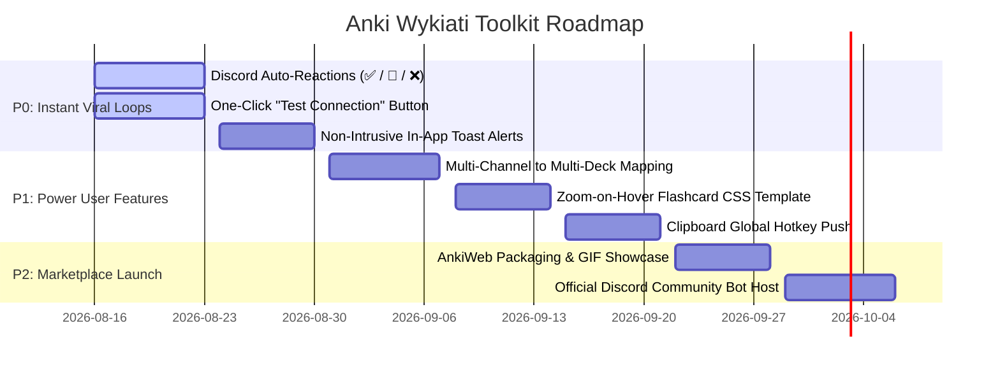

# Product Strategy & Feature Roadmap

> **Goal:** Position **Anki Wykiati Toolkit** as a Top #1 Trending, 5-Star community add-on on AnkiWeb, delivering zero-friction Discord-to-Anki flashcard creation, pure AMOLED dark aesthetics, and instant developer integrations.

---

## 1. Executive Summary & Core Value Proposition

Modern knowledge workers, medical students, software engineers, and language learners frequently share diagrams, screenshots, and study notes on Discord. Today, converting this content into Anki requires manual downloading, opening Anki, pasting images, typing fields, and organizing decks.

**Anki Wykiati Toolkit** solves this completely:
1. **Drop an image in a Discord channel** ➔ Automatically synced to the designated Anki deck in milliseconds.
2. **Post a structured text or Cloze message (`!anki`)** ➔ Parsed, validated, tagged, and inserted into the collection.
3. **Pure Void Black AMOLED Theme with Interactive RGB Wheel** ➔ A unified, battery-saving dark interface.
4. **Local HTTP REST Webhook Bridge** ➔ Instant programmable card creation from CLI tools, Chrome extensions, or Python scripts.

---

## 2. Feature Matrix & Priority Roadmap

---

## 3. Priority P0: Frictionless Onboarding & Viral Feedback

### A. Discord Real-Time Feedback Reactions (`✅`, `🔄`, `❌`)
- **User Flow:**
  1. A user uploads a diagram into Discord `#anatomy-cards`.
  2. The bot adds a `🔄` reaction indicating the image is queued.
  3. When the background sync worker persists the note into Anki, the bot updates the reaction to `✅`.
  4. If duplicate prevention or format errors trigger, the bot reacts with `❌` and sends an ephemeral error hint.
- **Viral Impact:** Every user in the Discord server witnesses live, visible confirmation that their flashcards are synchronizing in real time.

### B. "Test Connection" Diagnostics in Settings Modal
- Direct feedback button in `DiscordSettingsDialog`:
  - Validates Discord Bot Token against the Discord REST API (`/users/@me`).
  - Verifies read/write permissions on the configured channel IDs.
  - Displays instant visual badges: `✓ Connected as @WykiatiBot (Latency: 42ms)`.

### C. Non-Intrusive In-App Toast Notifications
- Subtle translucent HUD alert in Anki's bottom status bar:
  - `🖼️ Ingested 1 Image Card ➔ Medicine::Anatomy (10:45 AM)`
- Does not interrupt card reviewing sessions.

---

## 4. Priority P1: Advanced Power Features

### A. Multi-Channel to Multi-Deck Mapping Table
Instead of a single channel setting, support a flexible routing table:
| Discord Channel | Layout Mode | Target Anki Deck | Auto Tags |
|---|---|---|---|
| `#cardiology-images` | `image_only_front` | `Medicine::Cardiology` | `anatomy, cardio` |
| `#neurology-diagrams` | `image_only_front` | `Medicine::Neurology` | `neuro, diagrams` |
| `#code-snippets` | `image_back` | `Computer Science::DSA` | `algorithms` |

### B. Global Clipboard Push Hotkey (`Ctrl+Shift+V`)
- Pressing `Ctrl+Shift+V` inside Anki grabs the active screenshot in the system clipboard and immediately drafts or enqueues a flashcard in the default deck.

---

## 5. AnkiWeb Marketplace Launch Strategy

1. **Title & Tagline:**
   - *Anki Wykiati Toolkit — Automated Discord Image Sync & Minimalist RGB Theme*
2. **Visual Showcase:**
   - 3 animated GIF demonstrations (Image push from Discord, RGB color picker, live dashboard).
   - High-contrast banner graphic.
3. **Cross-Version Support Badge:**
   - Guaranteed compatibility with Anki 2.1.50+ up to 26.x (PyQt5, PyQt6, Qt 6.8+, Windows, macOS, Linux).
4. **Community Support & Issue Tracker:**
   - GitHub Releases with one-click `.ankiaddon` downloads.
