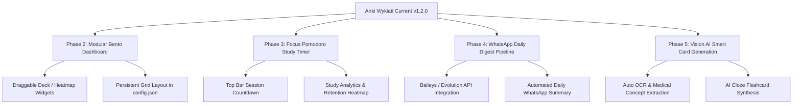

# Anki Wykiati Toolkit - Progress Report & Future Roadmap

**Document Version:** 1.2.0  
**Repository:** [git@github.com:Andr3wGustavo/anki-wykiati-addon.git](git@github.com:Andr3wGustavo/anki-wykiati-addon.git)  
**Date:** August 15, 2026  
**Author:** Senior Software Engineering Team  

---

## Executive Summary

The **Anki Wykiati Toolkit** is a modular, production-grade add-on for Anki Desktop (2.1.50+ / 23.x / 24.x). It bridges Discord communication channels and local REST webhooks directly to the Anki collection database while delivering an ultra-minimalist, hardware-accelerated **Full Void Black (#000000)** visual theme inspired by high-end developer software (Linear, Vercel, Apple Pro).

---

## 1. Accomplishments & Completed Engineering Milestones

### 1.1 Automated Discord Image Ingestion Pipeline
- **Dedicated Image Channel Support**: Ingests image attachments directly from specified Discord channels without requiring manual `!anki` prefixes.
- **Direct Media Storage Writing**: Images are binary-downloaded, hashed using cryptographic **SHA-256**, and written straight to Anki's local media folder (`collection.media`).
- **Configurable Layouts**: Supports `image_front` (image on front, caption on back) and `image_back` (question on front, image on back).
- **Anti-Duplication**: Prevents duplicate imports using persistent message ID and content hashing registries.

### 1.2 Full Void Black (#000000) Theme Engine
- **Universal 100% Black Coverage**: Deep black `#000000` forced across all native Qt widgets, Top Navigation Toolbar (`#header`), Deck Browser (`#deckbrowser`), Card Reviewer (`#qa`, `.card`), and Bottom Action Bar (`#bottomWeb`).
- **Floating Translucent Capsule Buttons**: Buttons styled with subtle glass surfaces (`rgba(255, 255, 255, 0.04)`), whisper-thin borders (`1px solid rgba(255, 255, 255, 0.08)`), and instant micro-transitions (`0.08s ease`).
- **Direct Logo Injection**: Official brand logo (`imgs/logo_nova.png`) embedded as an instant zero-latency Base64 Data URI in `theme/logo_data.py` and dynamically injected into the Deck Browser start screen.
- **Hardware-Accelerated Zero-Lag Compositing**: GPU layer promotion (`translateZ(0)`) eliminates Chromium compositor stalls, ensuring a locked 144Hz fluid experience.
- **Perfect Center Alignment**: Card containers and anatomical/medical images are centered with responsive boundaries (`max-width: 820px; max-height: 480px`).

### 1.3 Architecture, Security, and Core Reliability
- **Clean Architecture**: Decoupled layers (`anki/`, `core/`, `discord/`, `hooks/`, `routing/`, `sync/`, `templates/`, `theme/`, `ui/`).
- **Lifecycle Startup Guard**: Fixed `AttributeError: 'NoneType' object has no attribute 'sched'` by strictly checking `getattr(mw, "col", None) is not None` before triggering view redraws.
- **Clean English UI & Zero Emojis**: 100% of menus, dialogs, bot command responses, and logs localized to clean, professional English without emojis.
- **Robust Automated Test Suite**: 38 automated unit tests covering parser, security policy, anti-duplication, job queue FIFO, deck routing, and theme generation (100% passing).

### 1.4 Packaging & Developer Control Panel
- **`test_addon.bat`**: Interactive command-line control panel with dedicated Option `[5]` to clean legacy/duplicate add-on folders from `%APPDATA%\Anki2\addons21\` and perform fresh installs.
- **Live Visual Previews**:
  - `preview.html`: Browser-based interactive preview with view toggles (Home Deck Browser & Study Card Reviewer).
  - `preview_ui.py`: Standalone native PyQt dialog launcher.
- **Technical Documentation**: Comprehensive [`README.md`](../README.md) with embedded screenshots (`imgs/anki full black.png`) and logo (`imgs/logo_nova.png`).

---

## 2. System Verification & Test Status

```text
Ran 38 tests in 0.207s
OK (All 38 test suites passing in headless mode)
```

| Test Suite | Test Cases | Status |
|---|---|---|
| `test_bridge_and_commands.py` | 5 | PASS (100%) |
| `test_config.py` | 4 | PASS (100%) |
| `test_images.py` | 3 | PASS (100%) |
| `test_parser.py` | 6 | PASS (100%) |
| `test_queue_and_dedup.py` | 3 | PASS (100%) |
| `test_routing.py` | 4 | PASS (100%) |
| `test_security.py` | 4 | PASS (100%) |
| `test_templates_and_adapter.py` | 5 | PASS (100%) |
| `test_theme.py` | 4 | PASS (100%) |

---

## 3. Next Steps & Feature Roadmap



### 3.1 Phase 2: Modular Bento Box & Draggable Dashboard
- **Concept**: Turn the Deck Browser start screen into a modular Bento Grid where each element (Deck List, Heatmap, Discord Ingestion Stream, Daily Retention) is an interactive draggable card (`draggable="true"`).
- **Implementation**:
  - CSS Grid with `grid-template-columns: repeat(auto-fit, minmax(280px, 1fr))`.
  - Save custom panel coordinates into `config.json` (`dashboard.layout`).
  - Native Qt option using `QDockWidget` for multi-monitor setups.

### 3.2 Phase 3: Integrated Focus Pomodoro Timer with Study History
- **Concept**: Built-in 25/5 study session timer in the top navigation bar with audio chime and historical metrics.
- **Database Schema**:
  ```sql
  CREATE TABLE study_sessions (
      id TEXT PRIMARY KEY,
      start_timestamp INTEGER NOT NULL,
      end_timestamp INTEGER NOT NULL,
      duration_minutes INTEGER NOT NULL,
      cards_reviewed INTEGER NOT NULL,
      retention_rate REAL NOT NULL
  );
  ```
- **UI Component**: Monochromatic glass capsule displaying countdown and daily streak metrics.

### 3.3 Phase 4: WhatsApp Daily Flashcard Digest
- **Concept**: Send a daily morning or evening WhatsApp summary of due cards, study streak, and key cards to review.
- **Architecture**:
  - Lightweight webhook integration with **Evolution API** or **Baileys** (WhatsApp Web Multi-Device).
  - Outbound endpoint in `sync/worker.py` sending formatted messages:
    ```text
    *Wykiati Study Digest - August 15*
    Due Today: 32 cards (Medicine::Cardiology)
    Current Streak: 14 days
    Top Priority: Human Heart Anatomy
    ```

### 3.4 Phase 5: Vision AI Smart Flashcard Generator
- **Concept**: Automatic extraction of questions, cloze deletions, and medical terminology directly from Discord image attachments using local Gemini/OpenAI vision models before card creation.

---

## 4. Maintenance & Routine Commands

### Running the Test Suite:
```bash
python -m unittest discover -s anki-addon/tests -p "test_*.py" -v
```

### Building the Release Package:
```bash
python package_addon.py
# Output: release/anki-discord-toolkit.ankiaddon
```

### Clean Installation into Local Anki:
Run [`test_addon.bat`](../test_addon.bat) and select **Option [5]**.

---

*End of Report. Ready to resume next session.*
